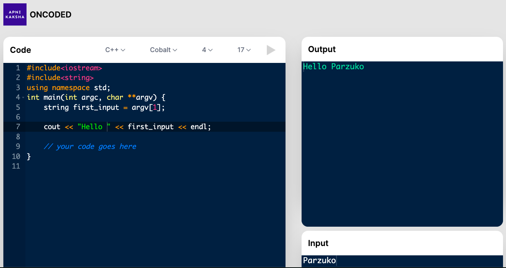
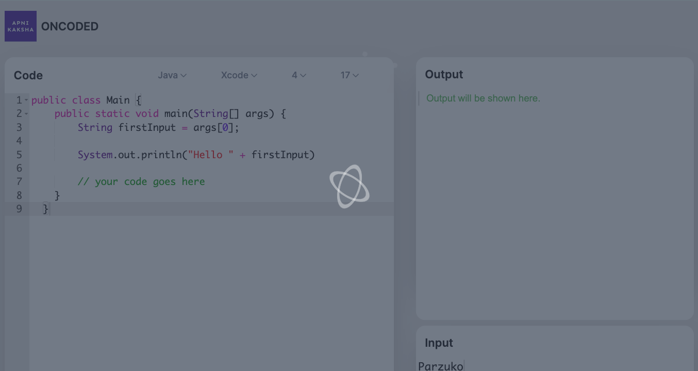
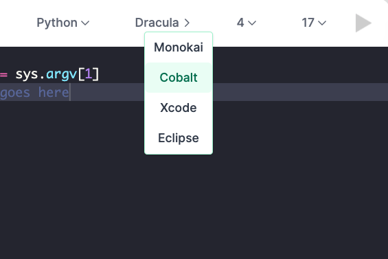
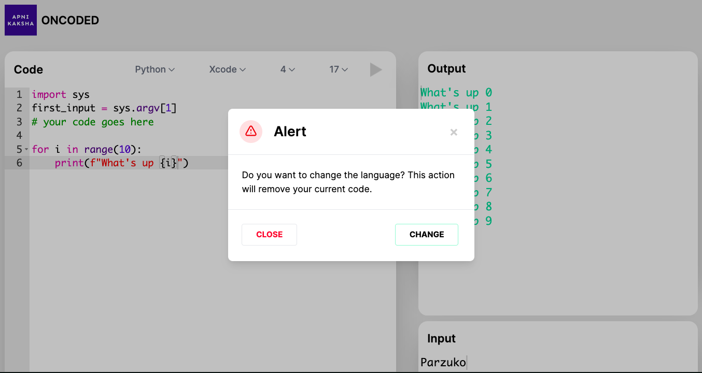

# Kiba: Remote Code Execution Engine

> Kiba is a highly scalable remote code execution engine built using NodeJS, Docker. It can handle over 10,000 requests per second with containerized execution. It is the engine use in the [Apni Kaksha Playground](https://www.apnikaksha.net/playground/)


This is the final build of an IDE using React and the Ace Editor.
## Editor Landing:


## Code Running Animation


## Choose Languages


## Change Language Prompt



```bash
# to clone
git clone https://github.com/parzuko/kiba

# run container
docker-compose up -d api

# install packages using cli (once only)
chmod +x cli/index.js   # only if not root user
cli/index.js kpack install <package> # any language python, java, gcc
```
## Package Control

To check installed packages and potentially install more:

```bash
cli/index.js kpack list 
# • gcc 10.2.0
# • java 15.0.2
# • python 3.9.4
cli/index.js kpack install java
```


## Request Format and Response 

### 1. `POST /api/execute`

### Parameter Body Details

- `language` (required) The language to use for execution, must be a string and must be installed.
- `version` (required) The version of the language to use for execution, must be a string containing a SemVer selector for the version or the specific version number to use.
- `files` (required) An array of files containing code or other data that should be used for execution. The first file in this array is considered the main file.
- `files[].name` (optional) The name of the file to upload, must be a string containing no path or left out.
- `files[].content` (required) The content of the files to upload, must be a string containing text to write
- `stdin` (optional) The text to pass as stdin to the program. Must be a string or left out. Defaults to blank string.
- `args`(optional) The arguments to pass to the program. Must be an array or left out. Defaults to [].
- `compile_timeout` (optional) The maximum time allowed for the compile stage to finish before bailing out in milliseconds. Must be a number or left out. Defaults to `10000` (10 seconds).
- `run_timeout`(optional) The maximum time allowed for the run stage to finish before bailing out in milliseconds. Must be a number or left out. Defaults to `3000` (3 seconds).
- `compile_memory_limit` (optional) The maximum amount of memory the compile stage is allowed to use in bytes. Must be a number or left out. Defaults to `-1` (no limit)
- `run_memory_limit`(optional) The maximum amount of memory the run stage is allowed to use in bytes. Must be a number or left out. Defaults to `-1` (no limit)

#### 1. VM Compiled Languages


```json
{
  "language": "java",
  "version": "15.0.2",
  "files": [
    {
      "name": "Main",
      "content": "public class Main {\n    public static void main(String[] args) {\n        System.out.println(\"Hello World\");\n    }\n}\n"
    }
  ],
  "stdin": "",
  "args": [],
  "compile_timeout": 10000,
  "run_timeout": 10000,
  "compile_memory_limit": -1,
  "run_memory_limit": -1
}
```
#### Response 

```json
{
    "run": {
        "stdout": "Hello World\n",
        "stderr": "",
        "code": 0,
        "signal": null,
        "output": "Hello World\n"
    },
    "language": "java",
    "version": "15.0.2"
}
```

#### 2. Manual Compile and Run
   
```json
{
  "language": "c++",
  "version": "10.2.0",
  "files": [
    {
      "name": "main",
      "content": "#include <iostream>\nint main(){\nstd::cout<<\"hello there\";}"
    }
  ],
  "stdin": "",
  "args": [],
  "compile_timeout": 10000,
  "run_timeout": 10000,
  "compile_memory_limit": -1,
  "run_memory_limit": -1
}
```

#### Response 
```json
{
    "compile": {
        "stdout": "",
        "stderr": "",
        "code": 0,
        "signal": null,
        "output": ""
    },
    "run": {
        "stdout": "hello there",
        "stderr": "",
        "code": 0,
        "signal": null,
        "output": "hello there"
    },
    "language": "c++",
    "version": "10.2.0"
}
```

### 2. `GET /api/status`
```json
{
  "message": "Everything Is Awesome"
}
```

### 3. `GET /api/packages`

```json
[
  {
    "language": "gcc",
    "language_version": "10.2.0",
    "installed": true
  },
  {
    "language": "java",
    "language_version": "15.0.2",
    "installed": true
  },
  {
    "language": "python",
    "language_version": "3.9.4",
    "installed": true
  }
]
```

### 4. `GET /api/runtimes`

```json
[
  {
    "language": "c",
    "version": "10.2.0",
    "aliases": [
      "gcc"
    ],
    "runtime": "gcc"
  },
  {
    "language": "c++",
    "version": "10.2.0",
    "aliases": [
      "cpp",
      "g++"
    ],
    "runtime": "gcc"
  },
  {
    "language": "d",
    "version": "10.2.0",
    "aliases": [
      "gdc"
    ],
    "runtime": "gcc"
  },
  {
    "language": "fortran",
    "version": "10.2.0",
    "aliases": [
      "fortran",
      "f90"
    ],
    "runtime": "gcc"
  },
  {
    "language": "java",
    "version": "15.0.2",
    "aliases": [
      
    ]
  },
  {
    "language": "python",
    "version": "3.9.4",
    "aliases": [
      "py",
      "py3",
      "python3"
    ]
  }
]
```


### Notes while running:

This project uses `no-camel`. Essentially, instead of using traditional camelCase, it will be using `snake_script`

At `src/index.js` the main express app starts. It calls the api inside `api/kiba` and we have our first route working at the moment using `node index`:

## Setup Details
If you want to run docker as non-root user then you need to add it to the docker group.
```bash
# 1. Create the docker group if it does not exist
$ sudo groupadd docker
# 2. Add your user to the docker group.
$ sudo usermod -aG docker $USER
# 3. Run the following command or Logout and login again and run (that doesn't work you may need to reboot your machine first)
$ newgrp docker
#4. Check if docker can be run without root
$ docker-compose up
#5. Reboot if still got error
$ reboot
```
Taken from the docker official documentation: [manage-docker-as-a-non-root-user](https://docs.docker.com/engine/install/linux-postinstall/)
